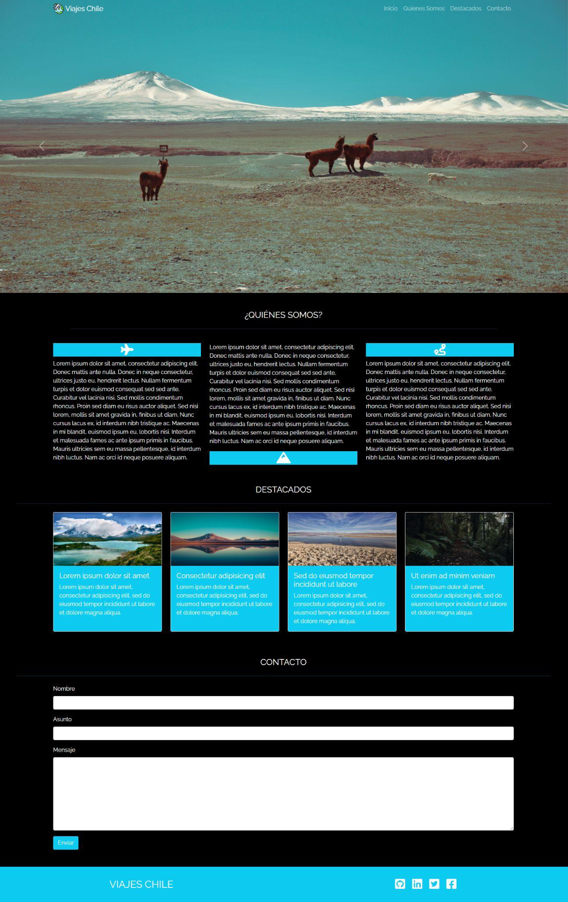

# Viajes Chile 

## Descripcion de la solución

## ¿Qué hace el proyecto? 
Viajes Chile es un proyecto realizado en el contexto de ser la evaluación de cierre de nivel del módulo Fundamentos de desarrollo  front-end, en el programa de desarrollo de aplicaciones Full Stack Javascript.
En el cual se evaluaron los siguientes contenidos: 

- Introducción a HTML.
- Crear páginas con HTML.
- Introducción a CSS.
- Añadiendo CSS al proyecto.
- Introducción a Bootstrap.
- Integrando Bootstrap.
- Usando Bootstrap para personalizar el proyecto.
- Componentes avanzados de Bootstrap.
- Introducción a JavaScript.
- Operaciones con JavaScript.
- Integrando jQuery.
- Bootstrap JS.
- Terminal y manejo de archivos.
- Introducción a Git.
- Introducción a Github.
- Trabajando con Git y Github.

## Instalación del Proyecto: 

para poder instalar y hacer correr el proyecto en nuestro local es necesario: 
- clonar el proyecto y abrir directamente.

## Dependencias:

Las herramientas utilizadas son: 

- Bootstrap
- JQuery 

## Estilos:

Toda el desafío fue desarrollado solo a partir de Bootstrap 5 principalmente y en complemento de una  hoja de estilo en cascada (CSS).

## Visualización
De forma general, se logra visualizar de la siguiente manera:

Puedes observar el resultado directamente en el siguiente enlace: 

`<link>` : https://camiserantoni.github.io/Prueba-ViajesChile/
